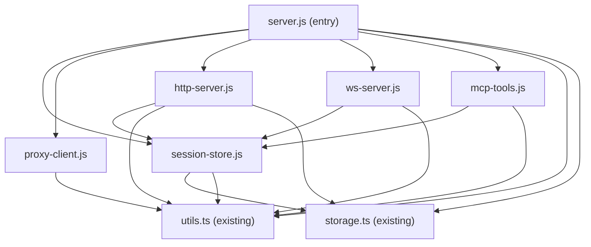

# server.js Decomposition Plan

## Background

`src/server.js` is ~2210 lines of JavaScript. The goal is to split it into
focused modules **while it is still JS**, so each piece can then convert to
TypeScript independently without a combined mega-diff. Each extraction step
must keep the test suite green — the integration tests spawn the server as a
subprocess (`node --experimental-strip-types src/server.js`), so
`src/server.js` remains the entry point throughout.

`widget.js` is browser-side code and is explicitly out of scope.

---

## Proposed Modules

### 1. `src/session-store.js` (new)

**What it contains** — lines 37–124

All mutable session state plus the accessor functions and orphan utilities
that operate on it:

- The five Maps/Sets: `sessionRegistry`, `pendingFeedbackBySession`,
  `readyFeedbackBySession`, `feedbackResolversBySession`,
  `connectedClientsBySession`, `connectedClients`
- The flag `isHttpServerOwner` — starts false, set to true in startup
- Accessor functions: `getSessionPending`, `setSessionPending`,
  `getSessionReady`, `setSessionReady`, `getSessionResolvers`,
  `getSessionClients`, `persistSession`
- Orphan utilities: `findOrphanBuckets`, `migrateOrphanInto`

**Exports**

```js
export {
  sessionRegistry,
  connectedClients,
  isHttpServerOwner, // mutable flag — needs a setter
  setHttpServerOwner, // setter so startup can flip it
  getSessionPending,
  setSessionPending,
  getSessionReady,
  setSessionReady,
  getSessionResolvers,
  getSessionClients,
  persistSession,
  findOrphanBuckets,
  migrateOrphanInto,
};
```

**Imports from siblings** — `./storage.ts`, `./utils.ts` (`isValidSessionId`,
`getPendingSummary`)

**Why it exists** — every other module touches session state. Isolating the
maps and their accessors here means all mutations flow through a single module
rather than being scattered across the HTTP, WebSocket, and MCP layers.

---

### 2. `src/proxy-client.js` (new)

**What it contains** — lines 155–277

All helper functions used by proxy (non-owner) MCP instances to reach the
owner server over HTTP:

- `fetchServerStatus`
- `fetchReadyFeedback`
- `pollForFeedback`
- `broadcastViaHttp`
- `fetchPendingSummary`
- `deleteFeedbackViaHttp`
- `registerSessionViaHttp`
- `unregisterSessionViaHttp`

These functions share nothing with each other except `PORT`, `SESSION_ID`,
and `PROCESS_ID` — all constants that must be passed in at construction time
or injected.

**Exports**

```js
export function createProxyClient({ port, sessionId, processId, projectDir }) {
  return {
    fetchServerStatus,
    fetchReadyFeedback,
    pollForFeedback,
    broadcastViaHttp,
    fetchPendingSummary,
    deleteFeedbackViaHttp,
    registerSessionViaHttp,
    unregisterSessionViaHttp,
  };
}
```

A factory pattern avoids passing `port`/`sessionId` through every call site
and makes the dependency explicit.

**Imports from siblings** — none (pure fetch calls; `detectProjectUrl` from
`./utils.ts` for `registerSessionViaHttp`)

---

### 3. `src/http-server.js` (new)

**What it contains** — lines 279–574

The `http.createServer(...)` handler and all REST endpoints:

- Static asset serving: `GET /widget.js`, `GET /html2canvas.min.js`,
  `GET /demo/`
- Data endpoints: `GET /status`, `GET /feedback`, `GET /pending-summary`,
  `DELETE /feedback/:id`, `POST /broadcast`
- Session lifecycle endpoints: `GET /sessions`, `POST /register-session`,
  `POST /unregister-session`
- Helpers: `parseJsonBody`, `broadcastPendingStatus`

**Exports**

```js
export function createHttpServer({ port, sessionStore, broadcastToSession }) {
  // returns: { httpServer }
}
```

`broadcastToSession` is injected so the HTTP layer can trigger WebSocket
broadcasts without importing the WebSocket module directly. `sessionStore` is
the object exported from `session-store.js`.

**Imports from siblings** — `./session-store.js`, `./utils.ts`
(`getPendingSummary`, `isValidSessionId`), `./storage.ts` (`remove`)

---

### 4. `src/ws-server.js` (new)

**What it contains** — lines 576–772

The `WebSocketServer` setup and all WebSocket message handling:

- `wss` creation and error handler
- `connection` handler: session resolution, rebind logic, `session_invalid`
  close, duplicate-client warning
- `message` handler for `feedback`, `send_to_claude`, `delete_feedback`
- `close` handler
- `broadcast` helper function (used by MCP tool handlers)

**Exports**

```js
export function createWsServer({ httpServer, port, sessionStore }) {
  // returns: { wss, broadcast }
}
```

`broadcast` is returned so the MCP layer can call it without importing `ws`
directly.

**Imports from siblings** — `./session-store.js`, `./utils.ts`
(`getPendingSummary`, `isValidSessionId`)

---

### 5. `src/mcp-tools.js` (new)

**What it contains** — lines 791–2027

The two MCP request handlers (`ListToolsRequestSchema` and
`CallToolRequestSchema`) and all tool implementations:

- Tool schema definitions (lines 791–997)
- Tool handler dispatch and all 10 `case` branches (lines 1000–2027):
  `install_widget`, `uninstall_widget`, `get_widget_snippet`,
  `wait_for_browser_feedback`, `get_pending_feedback`,
  `preview_pending_feedback`, `delete_pending_feedback`,
  `wait_for_multiple_feedback`, `get_connection_status`,
  `request_annotation`, `open_in_browser`, `setup_extension`

**Exports**

```js
export function registerMcpHandlers({
  mcpServer,
  port,
  sessionId,
  sessionStore,
  broadcast,
  proxy,
}) {
  // Calls mcpServer.setRequestHandler(...) for ListTools and CallTool.
  // No return value.
}
```

All runtime dependencies (port, sessionId, session state, broadcast, proxy
client) are injected; the tool implementations themselves contain no module-
level state.

**Imports from siblings** — `./session-store.js`, `./utils.ts`
(`detectProjectUrl`, `formatFeedbackAsContent`)

---

### 6. `src/server.js` (retained as entry point)

**What remains** — lines 1–36, 2029–2209 (constants, shutdown, startup)

After all extractions, `server.js` becomes an orchestrator:

- Module-level constants: `PORT`, `PKG_VERSION`, `PROJECT_DIR`, `SESSION_ID`,
  `PROCESS_ID`
- `tryListenWithRetry` — port-binding logic with zombie-detection retry
- `main` — wires everything together: MCP connect, HTTP bind, session
  rehydration from disk, session registration, startup logging
- `shutdown` — graceful teardown (flush storage, close WebSocket clients,
  close servers, unregister proxy sessions)
- Signal and stdin handlers

**Imports from siblings** — all four new modules plus `./utils.ts`,
`./storage.ts`

---

## Shared State Ownership

| State                        | Type                          | Owned by           | Notes                                                             |
| ---------------------------- | ----------------------------- | ------------------ | ----------------------------------------------------------------- |
| `sessionRegistry`            | `Map<string, SessionMeta>`    | `session-store.js` | Read/written by HTTP endpoints and startup                        |
| `pendingFeedbackBySession`   | `Map<string, Feedback[]>`     | `session-store.js` | Written by WS `feedback` message and HTTP DELETE                  |
| `readyFeedbackBySession`     | `Map<string, Feedback[]>`     | `session-store.js` | Written by WS `send_to_claude`; read by MCP tools                 |
| `feedbackResolversBySession` | `Map<string, Resolver[]>`     | `session-store.js` | Written/resolved by WS `send_to_claude`; pushed by MCP wait tools |
| `connectedClientsBySession`  | `Map<string, Set<WebSocket>>` | `session-store.js` | Mutated by WS connect/close; read by broadcast                    |
| `connectedClients`           | `Set<WebSocket>`              | `session-store.js` | Global client count for `/status` total                           |
| `isHttpServerOwner`          | `boolean`                     | `session-store.js` | Set once in `tryListenWithRetry`; read by all layers              |
| `isShuttingDown`             | `boolean`                     | `server.js`        | Guards double-shutdown; local to entry point                      |

**Design note on `isHttpServerOwner`**: this flag is the mode switch that
determines whether a process routes requests locally or proxies them. Putting
it in `session-store.js` alongside the data it gates keeps the branching
logic in one place. Exposing it via a `setHttpServerOwner(true)` setter (not
a raw export) prevents accidental mutation from the outside.

---

## Dependency Graph

[Full diagram](./diagrams/server-module-deps.mmd)



`proxy-client.js` and `session-store.js` have no dependency on each other —
they are parallel leaves. `http-server.js` and `ws-server.js` are siblings
that both depend on `session-store.js` but not on each other (the broadcast
dependency is injected by the entry point).

---

## Migration Order

Extract leaves first so each step has no new internal imports to satisfy.

### Step 1 — Extract `session-store.js`

**Why first**: every other new module imports it. Extracting the Maps and
their accessors gives the rest of the work a stable import target.

**Commit contract**: all Maps/Sets/flag move to the new file; `server.js`
imports them back. No logic changes. Tests pass because the HTTP endpoint
behaviour is identical — server.js still wires everything together.

**Test signal**: `tests/http-endpoints.test.js` — all session-lifecycle and
data-isolation tests pass.

---

### Step 2 — Extract `proxy-client.js`

**Why second**: no module depends on it; it only depends on `utils.ts` and
runtime constants. The eight proxy helper functions are pure fetch wrappers
with no shared state.

**Commit contract**: functions move verbatim; `server.js` imports and passes
the factory result to MCP handlers. No behaviour change. The `pollForFeedback`
call in the `wait_for_browser_feedback` tool case is the main consumer.

**Test signal**: proxy-mode behaviour is not directly tested by the current
suite (tests spawn one process that becomes the owner). No regression risk,
but confirm all existing tests still pass.

---

### Step 3 — Extract `http-server.js`

**Why third**: depends on `session-store.js` (Step 1) but not on the WS or
MCP modules. The HTTP server object is returned to `server.js` which passes
it to the WebSocket server constructor.

**Commit contract**: the `http.createServer(...)` call and all route handlers
move. `parseJsonBody` and `broadcastPendingStatus` move with them.
`server.js` calls `createHttpServer(...)` and destructures `{ httpServer }`.
The `broadcastToSession` callback is passed in — initially it can be a stub
(`() => {}`) until Step 4 wires it to the real WS broadcast.

**Test signal**: `tests/http-endpoints.test.js` — all endpoint and session
tests pass. This is the highest-value signal for this step.

---

### Step 4 — Extract `ws-server.js`

**Why fourth**: needs `httpServer` from Step 3. The `broadcast` function
produced here is what gets injected back into `http-server.js` via the
`broadcastToSession` callback wired in `server.js`.

**Commit contract**: `WebSocketServer` creation and all `connection`/
`message`/`close` handlers move. `broadcast` is exported. `server.js`
calls `createWsServer({ httpServer, port, sessionStore })`, then passes the
returned `broadcast` to `createHttpServer` (updating the stub from Step 3).

**Test signal**: `tests/http-endpoints.test.js` — WebSocket session-routing
tests (`session_invalid`, rebind, duplicate warning, feedback migration).

---

### Step 5 — Extract `mcp-tools.js`

**Why last**: depends on session state (Step 1), proxy client (Step 2), and
the `broadcast` function (Step 4). It is the largest block (~1200 lines) but
has no dependents — nothing imports from the MCP layer.

**Commit contract**: `mcpServer.setRequestHandler` calls for `ListTools` and
`CallTool` move into `registerMcpHandlers`. The `mcpServer` instance itself
stays in `server.js` (it is created, connected, and passed in). All tool
implementations move with their handler.

**Test signal**: `tests/http-endpoints.test.js` still passes (MCP tools are
not directly exercised by the HTTP test suite — they are tested indirectly by
the process being alive). Adding MCP tool unit tests is deferred to Epic 3.

---

## What Does Not Move

| Item                                                             | Stays in    | Reason                                                                            |
| ---------------------------------------------------------------- | ----------- | --------------------------------------------------------------------------------- |
| `PORT`, `PKG_VERSION`, `PROJECT_DIR`, `SESSION_ID`, `PROCESS_ID` | `server.js` | Module-level constants derived from environment; wired into everything at startup |
| `mcpServer` instantiation and `mcpServer.connect(transport)`     | `server.js` | Lifecycle — must connect before HTTP binds                                        |
| `tryListenWithRetry`                                             | `server.js` | Owns `isHttpServerOwner` transition; orchestrates the proxy/owner decision        |
| `main`, `shutdown`                                               | `server.js` | Top-level orchestration; the only consumers of all other modules                  |
| Signal handlers, stdin close                                     | `server.js` | Process lifecycle                                                                 |

---

## Test Compatibility Notes

- The test suite spawns `src/server.js` as a subprocess and hits HTTP
  endpoints. As long as `server.js` remains the entry point and exports no
  changed HTTP contract, all tests survive every extraction step without
  modification.
- `tests/utils.test.js` and `tests/storage.test.js` import `../src/utils.ts`
  and `../src/storage.ts` directly — neither file moves, so those tests are
  unaffected.
- No test currently exercises MCP tool handlers directly. The MCP layer
  extraction (Step 5) carries zero test risk from the existing suite.

---

## Information Requested

None. All module boundaries, state ownership, and test contracts were
derivable from the source.
